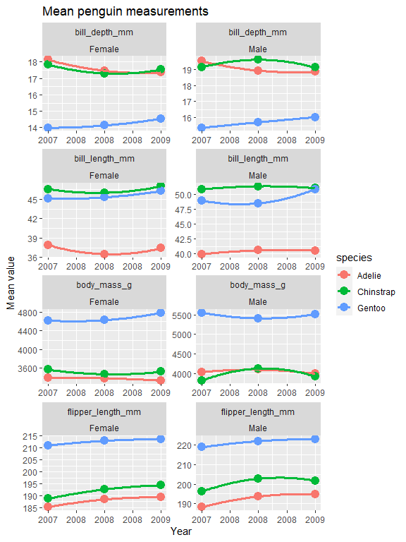

Data Wrangling I
================
Christopher Rounds
2/4/2022

# 1.1) Convert data from wide to long format

``` r
penguin.df <- read_rds("./data/penguin.RDS") %>%
              mutate(year = as.factor(year), sex  = str_to_title(sex) %>%
                       ifelse(is.na(.), "Unknown", .))
penguin.df #not tidy, each observation is not its own row
```

    ## # A tibble: 344 x 8
    ##    species island    bill_length_mm bill_depth_mm flipper_length_mm body_mass_g
    ##    <fct>   <fct>              <dbl>         <dbl>             <int>       <int>
    ##  1 Adelie  Torgersen           39.1          18.7               181        3750
    ##  2 Adelie  Torgersen           39.5          17.4               186        3800
    ##  3 Adelie  Torgersen           40.3          18                 195        3250
    ##  4 Adelie  Torgersen           NA            NA                  NA          NA
    ##  5 Adelie  Torgersen           36.7          19.3               193        3450
    ##  6 Adelie  Torgersen           39.3          20.6               190        3650
    ##  7 Adelie  Torgersen           38.9          17.8               181        3625
    ##  8 Adelie  Torgersen           39.2          19.6               195        4675
    ##  9 Adelie  Torgersen           34.1          18.1               193        3475
    ## 10 Adelie  Torgersen           42            20.2               190        4250
    ## # ... with 334 more rows, and 2 more variables: sex <chr>, year <fct>

``` r
tidy_penguin.df <- penguin.df %>% 
  pivot_longer(cols = contains("_"), 
               names_to = "measurement_type",
               values_to = "measurement") 
tidy_penguin.df #df is now "longer", and each observation is its own row
```

    ## # A tibble: 1,376 x 6
    ##    species island    sex    year  measurement_type  measurement
    ##    <fct>   <fct>     <chr>  <fct> <chr>                   <dbl>
    ##  1 Adelie  Torgersen Male   2007  bill_length_mm           39.1
    ##  2 Adelie  Torgersen Male   2007  bill_depth_mm            18.7
    ##  3 Adelie  Torgersen Male   2007  flipper_length_mm       181  
    ##  4 Adelie  Torgersen Male   2007  body_mass_g            3750  
    ##  5 Adelie  Torgersen Female 2007  bill_length_mm           39.5
    ##  6 Adelie  Torgersen Female 2007  bill_depth_mm            17.4
    ##  7 Adelie  Torgersen Female 2007  flipper_length_mm       186  
    ##  8 Adelie  Torgersen Female 2007  body_mass_g            3800  
    ##  9 Adelie  Torgersen Female 2007  bill_length_mm           40.3
    ## 10 Adelie  Torgersen Female 2007  bill_depth_mm            18  
    ## # ... with 1,366 more rows

# 1.2) Summarise measurements

``` r
tidy_penguin.df %>%
  group_by(sex, measurement_type) %>%
  summarise(median = median(measurement, na.rm = TRUE),
            mean = mean(measurement, na.rm = TRUE),
            sd = sd(measurement, na.rm = TRUE)) %>%
  gt() %>%
  tab_header("Summary of Measurements by Sex")
```

<div id="zcpnkknwya" style="overflow-x:auto;overflow-y:auto;width:auto;height:auto;">
<style>html {
  font-family: -apple-system, BlinkMacSystemFont, 'Segoe UI', Roboto, Oxygen, Ubuntu, Cantarell, 'Helvetica Neue', 'Fira Sans', 'Droid Sans', Arial, sans-serif;
}

#zcpnkknwya .gt_table {
  display: table;
  border-collapse: collapse;
  margin-left: auto;
  margin-right: auto;
  color: #333333;
  font-size: 16px;
  font-weight: normal;
  font-style: normal;
  background-color: #FFFFFF;
  width: auto;
  border-top-style: solid;
  border-top-width: 2px;
  border-top-color: #A8A8A8;
  border-right-style: none;
  border-right-width: 2px;
  border-right-color: #D3D3D3;
  border-bottom-style: solid;
  border-bottom-width: 2px;
  border-bottom-color: #A8A8A8;
  border-left-style: none;
  border-left-width: 2px;
  border-left-color: #D3D3D3;
}

#zcpnkknwya .gt_heading {
  background-color: #FFFFFF;
  text-align: center;
  border-bottom-color: #FFFFFF;
  border-left-style: none;
  border-left-width: 1px;
  border-left-color: #D3D3D3;
  border-right-style: none;
  border-right-width: 1px;
  border-right-color: #D3D3D3;
}

#zcpnkknwya .gt_title {
  color: #333333;
  font-size: 125%;
  font-weight: initial;
  padding-top: 4px;
  padding-bottom: 4px;
  border-bottom-color: #FFFFFF;
  border-bottom-width: 0;
}

#zcpnkknwya .gt_subtitle {
  color: #333333;
  font-size: 85%;
  font-weight: initial;
  padding-top: 0;
  padding-bottom: 6px;
  border-top-color: #FFFFFF;
  border-top-width: 0;
}

#zcpnkknwya .gt_bottom_border {
  border-bottom-style: solid;
  border-bottom-width: 2px;
  border-bottom-color: #D3D3D3;
}

#zcpnkknwya .gt_col_headings {
  border-top-style: solid;
  border-top-width: 2px;
  border-top-color: #D3D3D3;
  border-bottom-style: solid;
  border-bottom-width: 2px;
  border-bottom-color: #D3D3D3;
  border-left-style: none;
  border-left-width: 1px;
  border-left-color: #D3D3D3;
  border-right-style: none;
  border-right-width: 1px;
  border-right-color: #D3D3D3;
}

#zcpnkknwya .gt_col_heading {
  color: #333333;
  background-color: #FFFFFF;
  font-size: 100%;
  font-weight: normal;
  text-transform: inherit;
  border-left-style: none;
  border-left-width: 1px;
  border-left-color: #D3D3D3;
  border-right-style: none;
  border-right-width: 1px;
  border-right-color: #D3D3D3;
  vertical-align: bottom;
  padding-top: 5px;
  padding-bottom: 6px;
  padding-left: 5px;
  padding-right: 5px;
  overflow-x: hidden;
}

#zcpnkknwya .gt_column_spanner_outer {
  color: #333333;
  background-color: #FFFFFF;
  font-size: 100%;
  font-weight: normal;
  text-transform: inherit;
  padding-top: 0;
  padding-bottom: 0;
  padding-left: 4px;
  padding-right: 4px;
}

#zcpnkknwya .gt_column_spanner_outer:first-child {
  padding-left: 0;
}

#zcpnkknwya .gt_column_spanner_outer:last-child {
  padding-right: 0;
}

#zcpnkknwya .gt_column_spanner {
  border-bottom-style: solid;
  border-bottom-width: 2px;
  border-bottom-color: #D3D3D3;
  vertical-align: bottom;
  padding-top: 5px;
  padding-bottom: 5px;
  overflow-x: hidden;
  display: inline-block;
  width: 100%;
}

#zcpnkknwya .gt_group_heading {
  padding: 8px;
  color: #333333;
  background-color: #FFFFFF;
  font-size: 100%;
  font-weight: initial;
  text-transform: inherit;
  border-top-style: solid;
  border-top-width: 2px;
  border-top-color: #D3D3D3;
  border-bottom-style: solid;
  border-bottom-width: 2px;
  border-bottom-color: #D3D3D3;
  border-left-style: none;
  border-left-width: 1px;
  border-left-color: #D3D3D3;
  border-right-style: none;
  border-right-width: 1px;
  border-right-color: #D3D3D3;
  vertical-align: middle;
}

#zcpnkknwya .gt_empty_group_heading {
  padding: 0.5px;
  color: #333333;
  background-color: #FFFFFF;
  font-size: 100%;
  font-weight: initial;
  border-top-style: solid;
  border-top-width: 2px;
  border-top-color: #D3D3D3;
  border-bottom-style: solid;
  border-bottom-width: 2px;
  border-bottom-color: #D3D3D3;
  vertical-align: middle;
}

#zcpnkknwya .gt_from_md > :first-child {
  margin-top: 0;
}

#zcpnkknwya .gt_from_md > :last-child {
  margin-bottom: 0;
}

#zcpnkknwya .gt_row {
  padding-top: 8px;
  padding-bottom: 8px;
  padding-left: 5px;
  padding-right: 5px;
  margin: 10px;
  border-top-style: solid;
  border-top-width: 1px;
  border-top-color: #D3D3D3;
  border-left-style: none;
  border-left-width: 1px;
  border-left-color: #D3D3D3;
  border-right-style: none;
  border-right-width: 1px;
  border-right-color: #D3D3D3;
  vertical-align: middle;
  overflow-x: hidden;
}

#zcpnkknwya .gt_stub {
  color: #333333;
  background-color: #FFFFFF;
  font-size: 100%;
  font-weight: initial;
  text-transform: inherit;
  border-right-style: solid;
  border-right-width: 2px;
  border-right-color: #D3D3D3;
  padding-left: 12px;
}

#zcpnkknwya .gt_summary_row {
  color: #333333;
  background-color: #FFFFFF;
  text-transform: inherit;
  padding-top: 8px;
  padding-bottom: 8px;
  padding-left: 5px;
  padding-right: 5px;
}

#zcpnkknwya .gt_first_summary_row {
  padding-top: 8px;
  padding-bottom: 8px;
  padding-left: 5px;
  padding-right: 5px;
  border-top-style: solid;
  border-top-width: 2px;
  border-top-color: #D3D3D3;
}

#zcpnkknwya .gt_grand_summary_row {
  color: #333333;
  background-color: #FFFFFF;
  text-transform: inherit;
  padding-top: 8px;
  padding-bottom: 8px;
  padding-left: 5px;
  padding-right: 5px;
}

#zcpnkknwya .gt_first_grand_summary_row {
  padding-top: 8px;
  padding-bottom: 8px;
  padding-left: 5px;
  padding-right: 5px;
  border-top-style: double;
  border-top-width: 6px;
  border-top-color: #D3D3D3;
}

#zcpnkknwya .gt_striped {
  background-color: rgba(128, 128, 128, 0.05);
}

#zcpnkknwya .gt_table_body {
  border-top-style: solid;
  border-top-width: 2px;
  border-top-color: #D3D3D3;
  border-bottom-style: solid;
  border-bottom-width: 2px;
  border-bottom-color: #D3D3D3;
}

#zcpnkknwya .gt_footnotes {
  color: #333333;
  background-color: #FFFFFF;
  border-bottom-style: none;
  border-bottom-width: 2px;
  border-bottom-color: #D3D3D3;
  border-left-style: none;
  border-left-width: 2px;
  border-left-color: #D3D3D3;
  border-right-style: none;
  border-right-width: 2px;
  border-right-color: #D3D3D3;
}

#zcpnkknwya .gt_footnote {
  margin: 0px;
  font-size: 90%;
  padding: 4px;
}

#zcpnkknwya .gt_sourcenotes {
  color: #333333;
  background-color: #FFFFFF;
  border-bottom-style: none;
  border-bottom-width: 2px;
  border-bottom-color: #D3D3D3;
  border-left-style: none;
  border-left-width: 2px;
  border-left-color: #D3D3D3;
  border-right-style: none;
  border-right-width: 2px;
  border-right-color: #D3D3D3;
}

#zcpnkknwya .gt_sourcenote {
  font-size: 90%;
  padding: 4px;
}

#zcpnkknwya .gt_left {
  text-align: left;
}

#zcpnkknwya .gt_center {
  text-align: center;
}

#zcpnkknwya .gt_right {
  text-align: right;
  font-variant-numeric: tabular-nums;
}

#zcpnkknwya .gt_font_normal {
  font-weight: normal;
}

#zcpnkknwya .gt_font_bold {
  font-weight: bold;
}

#zcpnkknwya .gt_font_italic {
  font-style: italic;
}

#zcpnkknwya .gt_super {
  font-size: 65%;
}

#zcpnkknwya .gt_footnote_marks {
  font-style: italic;
  font-weight: normal;
  font-size: 65%;
}
</style>
<table class="gt_table">
  <thead class="gt_header">
    <tr>
      <th colspan="4" class="gt_heading gt_title gt_font_normal gt_bottom_border" style>Summary of Measurements by Sex</th>
    </tr>
    
  </thead>
  <thead class="gt_col_headings">
    <tr>
      <th class="gt_col_heading gt_columns_bottom_border gt_left" rowspan="1" colspan="1">measurement_type</th>
      <th class="gt_col_heading gt_columns_bottom_border gt_right" rowspan="1" colspan="1">median</th>
      <th class="gt_col_heading gt_columns_bottom_border gt_right" rowspan="1" colspan="1">mean</th>
      <th class="gt_col_heading gt_columns_bottom_border gt_right" rowspan="1" colspan="1">sd</th>
    </tr>
  </thead>
  <tbody class="gt_table_body">
    <tr class="gt_group_heading_row">
      <td colspan="4" class="gt_group_heading">Female</td>
    </tr>
    <tr><td class="gt_row gt_left">bill_depth_mm</td>
<td class="gt_row gt_right">17.0</td>
<td class="gt_row gt_right">16.4</td>
<td class="gt_row gt_right">1.80</td></tr>
    <tr><td class="gt_row gt_left">bill_length_mm</td>
<td class="gt_row gt_right">42.8</td>
<td class="gt_row gt_right">42.1</td>
<td class="gt_row gt_right">4.90</td></tr>
    <tr><td class="gt_row gt_left">body_mass_g</td>
<td class="gt_row gt_right">3650.0</td>
<td class="gt_row gt_right">3862.3</td>
<td class="gt_row gt_right">666.17</td></tr>
    <tr><td class="gt_row gt_left">flipper_length_mm</td>
<td class="gt_row gt_right">193.0</td>
<td class="gt_row gt_right">197.4</td>
<td class="gt_row gt_right">12.50</td></tr>
    <tr class="gt_group_heading_row">
      <td colspan="4" class="gt_group_heading">Male</td>
    </tr>
    <tr><td class="gt_row gt_left">bill_depth_mm</td>
<td class="gt_row gt_right">18.4</td>
<td class="gt_row gt_right">17.9</td>
<td class="gt_row gt_right">1.86</td></tr>
    <tr><td class="gt_row gt_left">bill_length_mm</td>
<td class="gt_row gt_right">46.8</td>
<td class="gt_row gt_right">45.9</td>
<td class="gt_row gt_right">5.37</td></tr>
    <tr><td class="gt_row gt_left">body_mass_g</td>
<td class="gt_row gt_right">4300.0</td>
<td class="gt_row gt_right">4545.7</td>
<td class="gt_row gt_right">787.63</td></tr>
    <tr><td class="gt_row gt_left">flipper_length_mm</td>
<td class="gt_row gt_right">200.5</td>
<td class="gt_row gt_right">204.5</td>
<td class="gt_row gt_right">14.55</td></tr>
    <tr class="gt_group_heading_row">
      <td colspan="4" class="gt_group_heading">Unknown</td>
    </tr>
    <tr><td class="gt_row gt_left">bill_depth_mm</td>
<td class="gt_row gt_right">17.1</td>
<td class="gt_row gt_right">16.6</td>
<td class="gt_row gt_right">2.24</td></tr>
    <tr><td class="gt_row gt_left">bill_length_mm</td>
<td class="gt_row gt_right">42.0</td>
<td class="gt_row gt_right">41.3</td>
<td class="gt_row gt_right">4.63</td></tr>
    <tr><td class="gt_row gt_left">body_mass_g</td>
<td class="gt_row gt_right">4100.0</td>
<td class="gt_row gt_right">4005.6</td>
<td class="gt_row gt_right">679.36</td></tr>
    <tr><td class="gt_row gt_left">flipper_length_mm</td>
<td class="gt_row gt_right">193.0</td>
<td class="gt_row gt_right">199.0</td>
<td class="gt_row gt_right">16.48</td></tr>
  </tbody>
  
  
</table>
</div>

``` r
tidy_penguin.df %>%
  group_by(sex, species, measurement_type) %>%
  summarise(median = median(measurement, na.rm = TRUE),
            mean = mean(measurement, na.rm = TRUE),
            sd = sd(measurement, na.rm = TRUE)) %>%
  gt() %>%
  tab_header("Summary of Measurements by Sex and Species")
```

<div id="lqubajkmeu" style="overflow-x:auto;overflow-y:auto;width:auto;height:auto;">
<style>html {
  font-family: -apple-system, BlinkMacSystemFont, 'Segoe UI', Roboto, Oxygen, Ubuntu, Cantarell, 'Helvetica Neue', 'Fira Sans', 'Droid Sans', Arial, sans-serif;
}

#lqubajkmeu .gt_table {
  display: table;
  border-collapse: collapse;
  margin-left: auto;
  margin-right: auto;
  color: #333333;
  font-size: 16px;
  font-weight: normal;
  font-style: normal;
  background-color: #FFFFFF;
  width: auto;
  border-top-style: solid;
  border-top-width: 2px;
  border-top-color: #A8A8A8;
  border-right-style: none;
  border-right-width: 2px;
  border-right-color: #D3D3D3;
  border-bottom-style: solid;
  border-bottom-width: 2px;
  border-bottom-color: #A8A8A8;
  border-left-style: none;
  border-left-width: 2px;
  border-left-color: #D3D3D3;
}

#lqubajkmeu .gt_heading {
  background-color: #FFFFFF;
  text-align: center;
  border-bottom-color: #FFFFFF;
  border-left-style: none;
  border-left-width: 1px;
  border-left-color: #D3D3D3;
  border-right-style: none;
  border-right-width: 1px;
  border-right-color: #D3D3D3;
}

#lqubajkmeu .gt_title {
  color: #333333;
  font-size: 125%;
  font-weight: initial;
  padding-top: 4px;
  padding-bottom: 4px;
  border-bottom-color: #FFFFFF;
  border-bottom-width: 0;
}

#lqubajkmeu .gt_subtitle {
  color: #333333;
  font-size: 85%;
  font-weight: initial;
  padding-top: 0;
  padding-bottom: 6px;
  border-top-color: #FFFFFF;
  border-top-width: 0;
}

#lqubajkmeu .gt_bottom_border {
  border-bottom-style: solid;
  border-bottom-width: 2px;
  border-bottom-color: #D3D3D3;
}

#lqubajkmeu .gt_col_headings {
  border-top-style: solid;
  border-top-width: 2px;
  border-top-color: #D3D3D3;
  border-bottom-style: solid;
  border-bottom-width: 2px;
  border-bottom-color: #D3D3D3;
  border-left-style: none;
  border-left-width: 1px;
  border-left-color: #D3D3D3;
  border-right-style: none;
  border-right-width: 1px;
  border-right-color: #D3D3D3;
}

#lqubajkmeu .gt_col_heading {
  color: #333333;
  background-color: #FFFFFF;
  font-size: 100%;
  font-weight: normal;
  text-transform: inherit;
  border-left-style: none;
  border-left-width: 1px;
  border-left-color: #D3D3D3;
  border-right-style: none;
  border-right-width: 1px;
  border-right-color: #D3D3D3;
  vertical-align: bottom;
  padding-top: 5px;
  padding-bottom: 6px;
  padding-left: 5px;
  padding-right: 5px;
  overflow-x: hidden;
}

#lqubajkmeu .gt_column_spanner_outer {
  color: #333333;
  background-color: #FFFFFF;
  font-size: 100%;
  font-weight: normal;
  text-transform: inherit;
  padding-top: 0;
  padding-bottom: 0;
  padding-left: 4px;
  padding-right: 4px;
}

#lqubajkmeu .gt_column_spanner_outer:first-child {
  padding-left: 0;
}

#lqubajkmeu .gt_column_spanner_outer:last-child {
  padding-right: 0;
}

#lqubajkmeu .gt_column_spanner {
  border-bottom-style: solid;
  border-bottom-width: 2px;
  border-bottom-color: #D3D3D3;
  vertical-align: bottom;
  padding-top: 5px;
  padding-bottom: 5px;
  overflow-x: hidden;
  display: inline-block;
  width: 100%;
}

#lqubajkmeu .gt_group_heading {
  padding: 8px;
  color: #333333;
  background-color: #FFFFFF;
  font-size: 100%;
  font-weight: initial;
  text-transform: inherit;
  border-top-style: solid;
  border-top-width: 2px;
  border-top-color: #D3D3D3;
  border-bottom-style: solid;
  border-bottom-width: 2px;
  border-bottom-color: #D3D3D3;
  border-left-style: none;
  border-left-width: 1px;
  border-left-color: #D3D3D3;
  border-right-style: none;
  border-right-width: 1px;
  border-right-color: #D3D3D3;
  vertical-align: middle;
}

#lqubajkmeu .gt_empty_group_heading {
  padding: 0.5px;
  color: #333333;
  background-color: #FFFFFF;
  font-size: 100%;
  font-weight: initial;
  border-top-style: solid;
  border-top-width: 2px;
  border-top-color: #D3D3D3;
  border-bottom-style: solid;
  border-bottom-width: 2px;
  border-bottom-color: #D3D3D3;
  vertical-align: middle;
}

#lqubajkmeu .gt_from_md > :first-child {
  margin-top: 0;
}

#lqubajkmeu .gt_from_md > :last-child {
  margin-bottom: 0;
}

#lqubajkmeu .gt_row {
  padding-top: 8px;
  padding-bottom: 8px;
  padding-left: 5px;
  padding-right: 5px;
  margin: 10px;
  border-top-style: solid;
  border-top-width: 1px;
  border-top-color: #D3D3D3;
  border-left-style: none;
  border-left-width: 1px;
  border-left-color: #D3D3D3;
  border-right-style: none;
  border-right-width: 1px;
  border-right-color: #D3D3D3;
  vertical-align: middle;
  overflow-x: hidden;
}

#lqubajkmeu .gt_stub {
  color: #333333;
  background-color: #FFFFFF;
  font-size: 100%;
  font-weight: initial;
  text-transform: inherit;
  border-right-style: solid;
  border-right-width: 2px;
  border-right-color: #D3D3D3;
  padding-left: 12px;
}

#lqubajkmeu .gt_summary_row {
  color: #333333;
  background-color: #FFFFFF;
  text-transform: inherit;
  padding-top: 8px;
  padding-bottom: 8px;
  padding-left: 5px;
  padding-right: 5px;
}

#lqubajkmeu .gt_first_summary_row {
  padding-top: 8px;
  padding-bottom: 8px;
  padding-left: 5px;
  padding-right: 5px;
  border-top-style: solid;
  border-top-width: 2px;
  border-top-color: #D3D3D3;
}

#lqubajkmeu .gt_grand_summary_row {
  color: #333333;
  background-color: #FFFFFF;
  text-transform: inherit;
  padding-top: 8px;
  padding-bottom: 8px;
  padding-left: 5px;
  padding-right: 5px;
}

#lqubajkmeu .gt_first_grand_summary_row {
  padding-top: 8px;
  padding-bottom: 8px;
  padding-left: 5px;
  padding-right: 5px;
  border-top-style: double;
  border-top-width: 6px;
  border-top-color: #D3D3D3;
}

#lqubajkmeu .gt_striped {
  background-color: rgba(128, 128, 128, 0.05);
}

#lqubajkmeu .gt_table_body {
  border-top-style: solid;
  border-top-width: 2px;
  border-top-color: #D3D3D3;
  border-bottom-style: solid;
  border-bottom-width: 2px;
  border-bottom-color: #D3D3D3;
}

#lqubajkmeu .gt_footnotes {
  color: #333333;
  background-color: #FFFFFF;
  border-bottom-style: none;
  border-bottom-width: 2px;
  border-bottom-color: #D3D3D3;
  border-left-style: none;
  border-left-width: 2px;
  border-left-color: #D3D3D3;
  border-right-style: none;
  border-right-width: 2px;
  border-right-color: #D3D3D3;
}

#lqubajkmeu .gt_footnote {
  margin: 0px;
  font-size: 90%;
  padding: 4px;
}

#lqubajkmeu .gt_sourcenotes {
  color: #333333;
  background-color: #FFFFFF;
  border-bottom-style: none;
  border-bottom-width: 2px;
  border-bottom-color: #D3D3D3;
  border-left-style: none;
  border-left-width: 2px;
  border-left-color: #D3D3D3;
  border-right-style: none;
  border-right-width: 2px;
  border-right-color: #D3D3D3;
}

#lqubajkmeu .gt_sourcenote {
  font-size: 90%;
  padding: 4px;
}

#lqubajkmeu .gt_left {
  text-align: left;
}

#lqubajkmeu .gt_center {
  text-align: center;
}

#lqubajkmeu .gt_right {
  text-align: right;
  font-variant-numeric: tabular-nums;
}

#lqubajkmeu .gt_font_normal {
  font-weight: normal;
}

#lqubajkmeu .gt_font_bold {
  font-weight: bold;
}

#lqubajkmeu .gt_font_italic {
  font-style: italic;
}

#lqubajkmeu .gt_super {
  font-size: 65%;
}

#lqubajkmeu .gt_footnote_marks {
  font-style: italic;
  font-weight: normal;
  font-size: 65%;
}
</style>
<table class="gt_table">
  <thead class="gt_header">
    <tr>
      <th colspan="4" class="gt_heading gt_title gt_font_normal gt_bottom_border" style>Summary of Measurements by Sex and Species</th>
    </tr>
    
  </thead>
  <thead class="gt_col_headings">
    <tr>
      <th class="gt_col_heading gt_columns_bottom_border gt_left" rowspan="1" colspan="1">measurement_type</th>
      <th class="gt_col_heading gt_columns_bottom_border gt_right" rowspan="1" colspan="1">median</th>
      <th class="gt_col_heading gt_columns_bottom_border gt_right" rowspan="1" colspan="1">mean</th>
      <th class="gt_col_heading gt_columns_bottom_border gt_right" rowspan="1" colspan="1">sd</th>
    </tr>
  </thead>
  <tbody class="gt_table_body">
    <tr class="gt_group_heading_row">
      <td colspan="4" class="gt_group_heading">Female - Adelie</td>
    </tr>
    <tr><td class="gt_row gt_left">bill_depth_mm</td>
<td class="gt_row gt_right">17.6</td>
<td class="gt_row gt_right">17.6</td>
<td class="gt_row gt_right">0.943</td></tr>
    <tr><td class="gt_row gt_left">bill_length_mm</td>
<td class="gt_row gt_right">37.0</td>
<td class="gt_row gt_right">37.3</td>
<td class="gt_row gt_right">2.029</td></tr>
    <tr><td class="gt_row gt_left">body_mass_g</td>
<td class="gt_row gt_right">3400.0</td>
<td class="gt_row gt_right">3368.8</td>
<td class="gt_row gt_right">269.380</td></tr>
    <tr><td class="gt_row gt_left">flipper_length_mm</td>
<td class="gt_row gt_right">188.0</td>
<td class="gt_row gt_right">187.8</td>
<td class="gt_row gt_right">5.595</td></tr>
    <tr class="gt_group_heading_row">
      <td colspan="4" class="gt_group_heading">Female - Chinstrap</td>
    </tr>
    <tr><td class="gt_row gt_left">bill_depth_mm</td>
<td class="gt_row gt_right">17.6</td>
<td class="gt_row gt_right">17.6</td>
<td class="gt_row gt_right">0.781</td></tr>
    <tr><td class="gt_row gt_left">bill_length_mm</td>
<td class="gt_row gt_right">46.3</td>
<td class="gt_row gt_right">46.6</td>
<td class="gt_row gt_right">3.109</td></tr>
    <tr><td class="gt_row gt_left">body_mass_g</td>
<td class="gt_row gt_right">3550.0</td>
<td class="gt_row gt_right">3527.2</td>
<td class="gt_row gt_right">285.334</td></tr>
    <tr><td class="gt_row gt_left">flipper_length_mm</td>
<td class="gt_row gt_right">192.0</td>
<td class="gt_row gt_right">191.7</td>
<td class="gt_row gt_right">5.754</td></tr>
    <tr class="gt_group_heading_row">
      <td colspan="4" class="gt_group_heading">Female - Gentoo</td>
    </tr>
    <tr><td class="gt_row gt_left">bill_depth_mm</td>
<td class="gt_row gt_right">14.2</td>
<td class="gt_row gt_right">14.2</td>
<td class="gt_row gt_right">0.540</td></tr>
    <tr><td class="gt_row gt_left">bill_length_mm</td>
<td class="gt_row gt_right">45.5</td>
<td class="gt_row gt_right">45.6</td>
<td class="gt_row gt_right">2.051</td></tr>
    <tr><td class="gt_row gt_left">body_mass_g</td>
<td class="gt_row gt_right">4700.0</td>
<td class="gt_row gt_right">4679.7</td>
<td class="gt_row gt_right">281.578</td></tr>
    <tr><td class="gt_row gt_left">flipper_length_mm</td>
<td class="gt_row gt_right">212.0</td>
<td class="gt_row gt_right">212.7</td>
<td class="gt_row gt_right">3.898</td></tr>
    <tr class="gt_group_heading_row">
      <td colspan="4" class="gt_group_heading">Male - Adelie</td>
    </tr>
    <tr><td class="gt_row gt_left">bill_depth_mm</td>
<td class="gt_row gt_right">18.9</td>
<td class="gt_row gt_right">19.1</td>
<td class="gt_row gt_right">1.019</td></tr>
    <tr><td class="gt_row gt_left">bill_length_mm</td>
<td class="gt_row gt_right">40.6</td>
<td class="gt_row gt_right">40.4</td>
<td class="gt_row gt_right">2.277</td></tr>
    <tr><td class="gt_row gt_left">body_mass_g</td>
<td class="gt_row gt_right">4000.0</td>
<td class="gt_row gt_right">4043.5</td>
<td class="gt_row gt_right">346.812</td></tr>
    <tr><td class="gt_row gt_left">flipper_length_mm</td>
<td class="gt_row gt_right">193.0</td>
<td class="gt_row gt_right">192.4</td>
<td class="gt_row gt_right">6.599</td></tr>
    <tr class="gt_group_heading_row">
      <td colspan="4" class="gt_group_heading">Male - Chinstrap</td>
    </tr>
    <tr><td class="gt_row gt_left">bill_depth_mm</td>
<td class="gt_row gt_right">19.3</td>
<td class="gt_row gt_right">19.3</td>
<td class="gt_row gt_right">0.761</td></tr>
    <tr><td class="gt_row gt_left">bill_length_mm</td>
<td class="gt_row gt_right">51.0</td>
<td class="gt_row gt_right">51.1</td>
<td class="gt_row gt_right">1.565</td></tr>
    <tr><td class="gt_row gt_left">body_mass_g</td>
<td class="gt_row gt_right">3950.0</td>
<td class="gt_row gt_right">3939.0</td>
<td class="gt_row gt_right">362.138</td></tr>
    <tr><td class="gt_row gt_left">flipper_length_mm</td>
<td class="gt_row gt_right">200.5</td>
<td class="gt_row gt_right">199.9</td>
<td class="gt_row gt_right">5.977</td></tr>
    <tr class="gt_group_heading_row">
      <td colspan="4" class="gt_group_heading">Male - Gentoo</td>
    </tr>
    <tr><td class="gt_row gt_left">bill_depth_mm</td>
<td class="gt_row gt_right">15.7</td>
<td class="gt_row gt_right">15.7</td>
<td class="gt_row gt_right">0.741</td></tr>
    <tr><td class="gt_row gt_left">bill_length_mm</td>
<td class="gt_row gt_right">49.5</td>
<td class="gt_row gt_right">49.5</td>
<td class="gt_row gt_right">2.721</td></tr>
    <tr><td class="gt_row gt_left">body_mass_g</td>
<td class="gt_row gt_right">5500.0</td>
<td class="gt_row gt_right">5484.8</td>
<td class="gt_row gt_right">313.159</td></tr>
    <tr><td class="gt_row gt_left">flipper_length_mm</td>
<td class="gt_row gt_right">221.0</td>
<td class="gt_row gt_right">221.5</td>
<td class="gt_row gt_right">5.673</td></tr>
    <tr class="gt_group_heading_row">
      <td colspan="4" class="gt_group_heading">Unknown - Adelie</td>
    </tr>
    <tr><td class="gt_row gt_left">bill_depth_mm</td>
<td class="gt_row gt_right">18.1</td>
<td class="gt_row gt_right">18.3</td>
<td class="gt_row gt_right">1.270</td></tr>
    <tr><td class="gt_row gt_left">bill_length_mm</td>
<td class="gt_row gt_right">37.8</td>
<td class="gt_row gt_right">37.8</td>
<td class="gt_row gt_right">2.802</td></tr>
    <tr><td class="gt_row gt_left">body_mass_g</td>
<td class="gt_row gt_right">3475.0</td>
<td class="gt_row gt_right">3540.0</td>
<td class="gt_row gt_right">477.166</td></tr>
    <tr><td class="gt_row gt_left">flipper_length_mm</td>
<td class="gt_row gt_right">186.0</td>
<td class="gt_row gt_right">185.6</td>
<td class="gt_row gt_right">6.107</td></tr>
    <tr class="gt_group_heading_row">
      <td colspan="4" class="gt_group_heading">Unknown - Gentoo</td>
    </tr>
    <tr><td class="gt_row gt_left">bill_depth_mm</td>
<td class="gt_row gt_right">14.4</td>
<td class="gt_row gt_right">14.6</td>
<td class="gt_row gt_right">0.810</td></tr>
    <tr><td class="gt_row gt_left">bill_length_mm</td>
<td class="gt_row gt_right">45.4</td>
<td class="gt_row gt_right">45.6</td>
<td class="gt_row gt_right">1.374</td></tr>
    <tr><td class="gt_row gt_left">body_mass_g</td>
<td class="gt_row gt_right">4687.5</td>
<td class="gt_row gt_right">4587.5</td>
<td class="gt_row gt_right">338.194</td></tr>
    <tr><td class="gt_row gt_left">flipper_length_mm</td>
<td class="gt_row gt_right">216.0</td>
<td class="gt_row gt_right">215.8</td>
<td class="gt_row gt_right">1.258</td></tr>
  </tbody>
  
  
</table>
</div>

``` r
tidy_penguin.df %>%
  group_by(sex, species, year, measurement_type) %>%
  dplyr::filter(sex == "Male" | sex == "Female") %>%
  summarise(mean = mean(measurement, na.rm = TRUE)) %>%
  mutate(year = year %>%
           as.character() %>%
           as.numeric()) %>%
  ggplot(aes(x = year, y = mean, colour = species)) +
  geom_point(size = 4) +
  stat_smooth(alpha = 0.1, size = 1.2, method = "loess", span = 2, se = FALSE) +
  facet_wrap(~measurement_type + sex, ncol = 2, scales = "free") +
  xlab("Year") +
  ylab("Mean value") +
  ggtitle("Mean penguin measurements")
```



# 2.1) group_by(), summarise() and across()

We can perform the exact same manipulation as above but without needing
to tidy the data first

``` r
penguin.df %>%
  group_by(sex) %>%
  summarise(across(contains("_"), 
                   ~ mean(.x, na.rm = TRUE), .names = "{.col}_mean")) %>% 
  gt()
```

<div id="zzcjhxrheq" style="overflow-x:auto;overflow-y:auto;width:auto;height:auto;">
<style>html {
  font-family: -apple-system, BlinkMacSystemFont, 'Segoe UI', Roboto, Oxygen, Ubuntu, Cantarell, 'Helvetica Neue', 'Fira Sans', 'Droid Sans', Arial, sans-serif;
}

#zzcjhxrheq .gt_table {
  display: table;
  border-collapse: collapse;
  margin-left: auto;
  margin-right: auto;
  color: #333333;
  font-size: 16px;
  font-weight: normal;
  font-style: normal;
  background-color: #FFFFFF;
  width: auto;
  border-top-style: solid;
  border-top-width: 2px;
  border-top-color: #A8A8A8;
  border-right-style: none;
  border-right-width: 2px;
  border-right-color: #D3D3D3;
  border-bottom-style: solid;
  border-bottom-width: 2px;
  border-bottom-color: #A8A8A8;
  border-left-style: none;
  border-left-width: 2px;
  border-left-color: #D3D3D3;
}

#zzcjhxrheq .gt_heading {
  background-color: #FFFFFF;
  text-align: center;
  border-bottom-color: #FFFFFF;
  border-left-style: none;
  border-left-width: 1px;
  border-left-color: #D3D3D3;
  border-right-style: none;
  border-right-width: 1px;
  border-right-color: #D3D3D3;
}

#zzcjhxrheq .gt_title {
  color: #333333;
  font-size: 125%;
  font-weight: initial;
  padding-top: 4px;
  padding-bottom: 4px;
  border-bottom-color: #FFFFFF;
  border-bottom-width: 0;
}

#zzcjhxrheq .gt_subtitle {
  color: #333333;
  font-size: 85%;
  font-weight: initial;
  padding-top: 0;
  padding-bottom: 6px;
  border-top-color: #FFFFFF;
  border-top-width: 0;
}

#zzcjhxrheq .gt_bottom_border {
  border-bottom-style: solid;
  border-bottom-width: 2px;
  border-bottom-color: #D3D3D3;
}

#zzcjhxrheq .gt_col_headings {
  border-top-style: solid;
  border-top-width: 2px;
  border-top-color: #D3D3D3;
  border-bottom-style: solid;
  border-bottom-width: 2px;
  border-bottom-color: #D3D3D3;
  border-left-style: none;
  border-left-width: 1px;
  border-left-color: #D3D3D3;
  border-right-style: none;
  border-right-width: 1px;
  border-right-color: #D3D3D3;
}

#zzcjhxrheq .gt_col_heading {
  color: #333333;
  background-color: #FFFFFF;
  font-size: 100%;
  font-weight: normal;
  text-transform: inherit;
  border-left-style: none;
  border-left-width: 1px;
  border-left-color: #D3D3D3;
  border-right-style: none;
  border-right-width: 1px;
  border-right-color: #D3D3D3;
  vertical-align: bottom;
  padding-top: 5px;
  padding-bottom: 6px;
  padding-left: 5px;
  padding-right: 5px;
  overflow-x: hidden;
}

#zzcjhxrheq .gt_column_spanner_outer {
  color: #333333;
  background-color: #FFFFFF;
  font-size: 100%;
  font-weight: normal;
  text-transform: inherit;
  padding-top: 0;
  padding-bottom: 0;
  padding-left: 4px;
  padding-right: 4px;
}

#zzcjhxrheq .gt_column_spanner_outer:first-child {
  padding-left: 0;
}

#zzcjhxrheq .gt_column_spanner_outer:last-child {
  padding-right: 0;
}

#zzcjhxrheq .gt_column_spanner {
  border-bottom-style: solid;
  border-bottom-width: 2px;
  border-bottom-color: #D3D3D3;
  vertical-align: bottom;
  padding-top: 5px;
  padding-bottom: 5px;
  overflow-x: hidden;
  display: inline-block;
  width: 100%;
}

#zzcjhxrheq .gt_group_heading {
  padding: 8px;
  color: #333333;
  background-color: #FFFFFF;
  font-size: 100%;
  font-weight: initial;
  text-transform: inherit;
  border-top-style: solid;
  border-top-width: 2px;
  border-top-color: #D3D3D3;
  border-bottom-style: solid;
  border-bottom-width: 2px;
  border-bottom-color: #D3D3D3;
  border-left-style: none;
  border-left-width: 1px;
  border-left-color: #D3D3D3;
  border-right-style: none;
  border-right-width: 1px;
  border-right-color: #D3D3D3;
  vertical-align: middle;
}

#zzcjhxrheq .gt_empty_group_heading {
  padding: 0.5px;
  color: #333333;
  background-color: #FFFFFF;
  font-size: 100%;
  font-weight: initial;
  border-top-style: solid;
  border-top-width: 2px;
  border-top-color: #D3D3D3;
  border-bottom-style: solid;
  border-bottom-width: 2px;
  border-bottom-color: #D3D3D3;
  vertical-align: middle;
}

#zzcjhxrheq .gt_from_md > :first-child {
  margin-top: 0;
}

#zzcjhxrheq .gt_from_md > :last-child {
  margin-bottom: 0;
}

#zzcjhxrheq .gt_row {
  padding-top: 8px;
  padding-bottom: 8px;
  padding-left: 5px;
  padding-right: 5px;
  margin: 10px;
  border-top-style: solid;
  border-top-width: 1px;
  border-top-color: #D3D3D3;
  border-left-style: none;
  border-left-width: 1px;
  border-left-color: #D3D3D3;
  border-right-style: none;
  border-right-width: 1px;
  border-right-color: #D3D3D3;
  vertical-align: middle;
  overflow-x: hidden;
}

#zzcjhxrheq .gt_stub {
  color: #333333;
  background-color: #FFFFFF;
  font-size: 100%;
  font-weight: initial;
  text-transform: inherit;
  border-right-style: solid;
  border-right-width: 2px;
  border-right-color: #D3D3D3;
  padding-left: 12px;
}

#zzcjhxrheq .gt_summary_row {
  color: #333333;
  background-color: #FFFFFF;
  text-transform: inherit;
  padding-top: 8px;
  padding-bottom: 8px;
  padding-left: 5px;
  padding-right: 5px;
}

#zzcjhxrheq .gt_first_summary_row {
  padding-top: 8px;
  padding-bottom: 8px;
  padding-left: 5px;
  padding-right: 5px;
  border-top-style: solid;
  border-top-width: 2px;
  border-top-color: #D3D3D3;
}

#zzcjhxrheq .gt_grand_summary_row {
  color: #333333;
  background-color: #FFFFFF;
  text-transform: inherit;
  padding-top: 8px;
  padding-bottom: 8px;
  padding-left: 5px;
  padding-right: 5px;
}

#zzcjhxrheq .gt_first_grand_summary_row {
  padding-top: 8px;
  padding-bottom: 8px;
  padding-left: 5px;
  padding-right: 5px;
  border-top-style: double;
  border-top-width: 6px;
  border-top-color: #D3D3D3;
}

#zzcjhxrheq .gt_striped {
  background-color: rgba(128, 128, 128, 0.05);
}

#zzcjhxrheq .gt_table_body {
  border-top-style: solid;
  border-top-width: 2px;
  border-top-color: #D3D3D3;
  border-bottom-style: solid;
  border-bottom-width: 2px;
  border-bottom-color: #D3D3D3;
}

#zzcjhxrheq .gt_footnotes {
  color: #333333;
  background-color: #FFFFFF;
  border-bottom-style: none;
  border-bottom-width: 2px;
  border-bottom-color: #D3D3D3;
  border-left-style: none;
  border-left-width: 2px;
  border-left-color: #D3D3D3;
  border-right-style: none;
  border-right-width: 2px;
  border-right-color: #D3D3D3;
}

#zzcjhxrheq .gt_footnote {
  margin: 0px;
  font-size: 90%;
  padding: 4px;
}

#zzcjhxrheq .gt_sourcenotes {
  color: #333333;
  background-color: #FFFFFF;
  border-bottom-style: none;
  border-bottom-width: 2px;
  border-bottom-color: #D3D3D3;
  border-left-style: none;
  border-left-width: 2px;
  border-left-color: #D3D3D3;
  border-right-style: none;
  border-right-width: 2px;
  border-right-color: #D3D3D3;
}

#zzcjhxrheq .gt_sourcenote {
  font-size: 90%;
  padding: 4px;
}

#zzcjhxrheq .gt_left {
  text-align: left;
}

#zzcjhxrheq .gt_center {
  text-align: center;
}

#zzcjhxrheq .gt_right {
  text-align: right;
  font-variant-numeric: tabular-nums;
}

#zzcjhxrheq .gt_font_normal {
  font-weight: normal;
}

#zzcjhxrheq .gt_font_bold {
  font-weight: bold;
}

#zzcjhxrheq .gt_font_italic {
  font-style: italic;
}

#zzcjhxrheq .gt_super {
  font-size: 65%;
}

#zzcjhxrheq .gt_footnote_marks {
  font-style: italic;
  font-weight: normal;
  font-size: 65%;
}
</style>
<table class="gt_table">
  
  <thead class="gt_col_headings">
    <tr>
      <th class="gt_col_heading gt_columns_bottom_border gt_left" rowspan="1" colspan="1">sex</th>
      <th class="gt_col_heading gt_columns_bottom_border gt_right" rowspan="1" colspan="1">bill_length_mm_mean</th>
      <th class="gt_col_heading gt_columns_bottom_border gt_right" rowspan="1" colspan="1">bill_depth_mm_mean</th>
      <th class="gt_col_heading gt_columns_bottom_border gt_right" rowspan="1" colspan="1">flipper_length_mm_mean</th>
      <th class="gt_col_heading gt_columns_bottom_border gt_right" rowspan="1" colspan="1">body_mass_g_mean</th>
    </tr>
  </thead>
  <tbody class="gt_table_body">
    <tr><td class="gt_row gt_left">Female</td>
<td class="gt_row gt_right">42.1</td>
<td class="gt_row gt_right">16.4</td>
<td class="gt_row gt_right">197</td>
<td class="gt_row gt_right">3862</td></tr>
    <tr><td class="gt_row gt_left">Male</td>
<td class="gt_row gt_right">45.9</td>
<td class="gt_row gt_right">17.9</td>
<td class="gt_row gt_right">205</td>
<td class="gt_row gt_right">4546</td></tr>
    <tr><td class="gt_row gt_left">Unknown</td>
<td class="gt_row gt_right">41.3</td>
<td class="gt_row gt_right">16.6</td>
<td class="gt_row gt_right">199</td>
<td class="gt_row gt_right">4006</td></tr>
  </tbody>
  
  
</table>
</div>

``` r
#remove units in the columns
penguin.df %>%
  group_by(sex) %>%
  summarise(across(contains("_"), 
                   ~ mean(.x, na.rm = TRUE), .names = "{.col}_mean")) %>% 
  pivot_longer(-sex, names_to = "measurement", values_to = "mean") %>%
  mutate(measurement = str_remove(measurement, "_mm|_g")) %>%
  pivot_wider(names_from = "measurement", values_from = "mean") %>%
  gt()
```

<div id="uuhczclekr" style="overflow-x:auto;overflow-y:auto;width:auto;height:auto;">
<style>html {
  font-family: -apple-system, BlinkMacSystemFont, 'Segoe UI', Roboto, Oxygen, Ubuntu, Cantarell, 'Helvetica Neue', 'Fira Sans', 'Droid Sans', Arial, sans-serif;
}

#uuhczclekr .gt_table {
  display: table;
  border-collapse: collapse;
  margin-left: auto;
  margin-right: auto;
  color: #333333;
  font-size: 16px;
  font-weight: normal;
  font-style: normal;
  background-color: #FFFFFF;
  width: auto;
  border-top-style: solid;
  border-top-width: 2px;
  border-top-color: #A8A8A8;
  border-right-style: none;
  border-right-width: 2px;
  border-right-color: #D3D3D3;
  border-bottom-style: solid;
  border-bottom-width: 2px;
  border-bottom-color: #A8A8A8;
  border-left-style: none;
  border-left-width: 2px;
  border-left-color: #D3D3D3;
}

#uuhczclekr .gt_heading {
  background-color: #FFFFFF;
  text-align: center;
  border-bottom-color: #FFFFFF;
  border-left-style: none;
  border-left-width: 1px;
  border-left-color: #D3D3D3;
  border-right-style: none;
  border-right-width: 1px;
  border-right-color: #D3D3D3;
}

#uuhczclekr .gt_title {
  color: #333333;
  font-size: 125%;
  font-weight: initial;
  padding-top: 4px;
  padding-bottom: 4px;
  border-bottom-color: #FFFFFF;
  border-bottom-width: 0;
}

#uuhczclekr .gt_subtitle {
  color: #333333;
  font-size: 85%;
  font-weight: initial;
  padding-top: 0;
  padding-bottom: 6px;
  border-top-color: #FFFFFF;
  border-top-width: 0;
}

#uuhczclekr .gt_bottom_border {
  border-bottom-style: solid;
  border-bottom-width: 2px;
  border-bottom-color: #D3D3D3;
}

#uuhczclekr .gt_col_headings {
  border-top-style: solid;
  border-top-width: 2px;
  border-top-color: #D3D3D3;
  border-bottom-style: solid;
  border-bottom-width: 2px;
  border-bottom-color: #D3D3D3;
  border-left-style: none;
  border-left-width: 1px;
  border-left-color: #D3D3D3;
  border-right-style: none;
  border-right-width: 1px;
  border-right-color: #D3D3D3;
}

#uuhczclekr .gt_col_heading {
  color: #333333;
  background-color: #FFFFFF;
  font-size: 100%;
  font-weight: normal;
  text-transform: inherit;
  border-left-style: none;
  border-left-width: 1px;
  border-left-color: #D3D3D3;
  border-right-style: none;
  border-right-width: 1px;
  border-right-color: #D3D3D3;
  vertical-align: bottom;
  padding-top: 5px;
  padding-bottom: 6px;
  padding-left: 5px;
  padding-right: 5px;
  overflow-x: hidden;
}

#uuhczclekr .gt_column_spanner_outer {
  color: #333333;
  background-color: #FFFFFF;
  font-size: 100%;
  font-weight: normal;
  text-transform: inherit;
  padding-top: 0;
  padding-bottom: 0;
  padding-left: 4px;
  padding-right: 4px;
}

#uuhczclekr .gt_column_spanner_outer:first-child {
  padding-left: 0;
}

#uuhczclekr .gt_column_spanner_outer:last-child {
  padding-right: 0;
}

#uuhczclekr .gt_column_spanner {
  border-bottom-style: solid;
  border-bottom-width: 2px;
  border-bottom-color: #D3D3D3;
  vertical-align: bottom;
  padding-top: 5px;
  padding-bottom: 5px;
  overflow-x: hidden;
  display: inline-block;
  width: 100%;
}

#uuhczclekr .gt_group_heading {
  padding: 8px;
  color: #333333;
  background-color: #FFFFFF;
  font-size: 100%;
  font-weight: initial;
  text-transform: inherit;
  border-top-style: solid;
  border-top-width: 2px;
  border-top-color: #D3D3D3;
  border-bottom-style: solid;
  border-bottom-width: 2px;
  border-bottom-color: #D3D3D3;
  border-left-style: none;
  border-left-width: 1px;
  border-left-color: #D3D3D3;
  border-right-style: none;
  border-right-width: 1px;
  border-right-color: #D3D3D3;
  vertical-align: middle;
}

#uuhczclekr .gt_empty_group_heading {
  padding: 0.5px;
  color: #333333;
  background-color: #FFFFFF;
  font-size: 100%;
  font-weight: initial;
  border-top-style: solid;
  border-top-width: 2px;
  border-top-color: #D3D3D3;
  border-bottom-style: solid;
  border-bottom-width: 2px;
  border-bottom-color: #D3D3D3;
  vertical-align: middle;
}

#uuhczclekr .gt_from_md > :first-child {
  margin-top: 0;
}

#uuhczclekr .gt_from_md > :last-child {
  margin-bottom: 0;
}

#uuhczclekr .gt_row {
  padding-top: 8px;
  padding-bottom: 8px;
  padding-left: 5px;
  padding-right: 5px;
  margin: 10px;
  border-top-style: solid;
  border-top-width: 1px;
  border-top-color: #D3D3D3;
  border-left-style: none;
  border-left-width: 1px;
  border-left-color: #D3D3D3;
  border-right-style: none;
  border-right-width: 1px;
  border-right-color: #D3D3D3;
  vertical-align: middle;
  overflow-x: hidden;
}

#uuhczclekr .gt_stub {
  color: #333333;
  background-color: #FFFFFF;
  font-size: 100%;
  font-weight: initial;
  text-transform: inherit;
  border-right-style: solid;
  border-right-width: 2px;
  border-right-color: #D3D3D3;
  padding-left: 12px;
}

#uuhczclekr .gt_summary_row {
  color: #333333;
  background-color: #FFFFFF;
  text-transform: inherit;
  padding-top: 8px;
  padding-bottom: 8px;
  padding-left: 5px;
  padding-right: 5px;
}

#uuhczclekr .gt_first_summary_row {
  padding-top: 8px;
  padding-bottom: 8px;
  padding-left: 5px;
  padding-right: 5px;
  border-top-style: solid;
  border-top-width: 2px;
  border-top-color: #D3D3D3;
}

#uuhczclekr .gt_grand_summary_row {
  color: #333333;
  background-color: #FFFFFF;
  text-transform: inherit;
  padding-top: 8px;
  padding-bottom: 8px;
  padding-left: 5px;
  padding-right: 5px;
}

#uuhczclekr .gt_first_grand_summary_row {
  padding-top: 8px;
  padding-bottom: 8px;
  padding-left: 5px;
  padding-right: 5px;
  border-top-style: double;
  border-top-width: 6px;
  border-top-color: #D3D3D3;
}

#uuhczclekr .gt_striped {
  background-color: rgba(128, 128, 128, 0.05);
}

#uuhczclekr .gt_table_body {
  border-top-style: solid;
  border-top-width: 2px;
  border-top-color: #D3D3D3;
  border-bottom-style: solid;
  border-bottom-width: 2px;
  border-bottom-color: #D3D3D3;
}

#uuhczclekr .gt_footnotes {
  color: #333333;
  background-color: #FFFFFF;
  border-bottom-style: none;
  border-bottom-width: 2px;
  border-bottom-color: #D3D3D3;
  border-left-style: none;
  border-left-width: 2px;
  border-left-color: #D3D3D3;
  border-right-style: none;
  border-right-width: 2px;
  border-right-color: #D3D3D3;
}

#uuhczclekr .gt_footnote {
  margin: 0px;
  font-size: 90%;
  padding: 4px;
}

#uuhczclekr .gt_sourcenotes {
  color: #333333;
  background-color: #FFFFFF;
  border-bottom-style: none;
  border-bottom-width: 2px;
  border-bottom-color: #D3D3D3;
  border-left-style: none;
  border-left-width: 2px;
  border-left-color: #D3D3D3;
  border-right-style: none;
  border-right-width: 2px;
  border-right-color: #D3D3D3;
}

#uuhczclekr .gt_sourcenote {
  font-size: 90%;
  padding: 4px;
}

#uuhczclekr .gt_left {
  text-align: left;
}

#uuhczclekr .gt_center {
  text-align: center;
}

#uuhczclekr .gt_right {
  text-align: right;
  font-variant-numeric: tabular-nums;
}

#uuhczclekr .gt_font_normal {
  font-weight: normal;
}

#uuhczclekr .gt_font_bold {
  font-weight: bold;
}

#uuhczclekr .gt_font_italic {
  font-style: italic;
}

#uuhczclekr .gt_super {
  font-size: 65%;
}

#uuhczclekr .gt_footnote_marks {
  font-style: italic;
  font-weight: normal;
  font-size: 65%;
}
</style>
<table class="gt_table">
  
  <thead class="gt_col_headings">
    <tr>
      <th class="gt_col_heading gt_columns_bottom_border gt_left" rowspan="1" colspan="1">sex</th>
      <th class="gt_col_heading gt_columns_bottom_border gt_right" rowspan="1" colspan="1">bill_length_mean</th>
      <th class="gt_col_heading gt_columns_bottom_border gt_right" rowspan="1" colspan="1">bill_depth_mean</th>
      <th class="gt_col_heading gt_columns_bottom_border gt_right" rowspan="1" colspan="1">flipper_length_mean</th>
      <th class="gt_col_heading gt_columns_bottom_border gt_right" rowspan="1" colspan="1">body_mass_mean</th>
    </tr>
  </thead>
  <tbody class="gt_table_body">
    <tr><td class="gt_row gt_left">Female</td>
<td class="gt_row gt_right">42.1</td>
<td class="gt_row gt_right">16.4</td>
<td class="gt_row gt_right">197</td>
<td class="gt_row gt_right">3862</td></tr>
    <tr><td class="gt_row gt_left">Male</td>
<td class="gt_row gt_right">45.9</td>
<td class="gt_row gt_right">17.9</td>
<td class="gt_row gt_right">205</td>
<td class="gt_row gt_right">4546</td></tr>
    <tr><td class="gt_row gt_left">Unknown</td>
<td class="gt_row gt_right">41.3</td>
<td class="gt_row gt_right">16.6</td>
<td class="gt_row gt_right">199</td>
<td class="gt_row gt_right">4006</td></tr>
  </tbody>
  
  
</table>
</div>

# 2.2) Summarise Measurements with mean and median by Sex and Species

``` r
penguin.df %>%
  group_by(sex, species) %>%
  summarise(across(contains("_"), 
                  list(mean = mean, median = median), #use functions mean and median
                  na.rm = TRUE, .names = "{.col}_{.fn}")) %>%  
  #names the output columns the column name and the way it was summarised (mean or median)
  pivot_longer(-c(sex,species), names_to = "measurement", values_to = "mean") %>%
  mutate(measurement = str_remove(measurement, "_mm|_g")) %>%
  pivot_wider(names_from = "measurement", values_from = "mean") %>%
  gt()
```

<div id="kzwwowxvnz" style="overflow-x:auto;overflow-y:auto;width:auto;height:auto;">
<style>html {
  font-family: -apple-system, BlinkMacSystemFont, 'Segoe UI', Roboto, Oxygen, Ubuntu, Cantarell, 'Helvetica Neue', 'Fira Sans', 'Droid Sans', Arial, sans-serif;
}

#kzwwowxvnz .gt_table {
  display: table;
  border-collapse: collapse;
  margin-left: auto;
  margin-right: auto;
  color: #333333;
  font-size: 16px;
  font-weight: normal;
  font-style: normal;
  background-color: #FFFFFF;
  width: auto;
  border-top-style: solid;
  border-top-width: 2px;
  border-top-color: #A8A8A8;
  border-right-style: none;
  border-right-width: 2px;
  border-right-color: #D3D3D3;
  border-bottom-style: solid;
  border-bottom-width: 2px;
  border-bottom-color: #A8A8A8;
  border-left-style: none;
  border-left-width: 2px;
  border-left-color: #D3D3D3;
}

#kzwwowxvnz .gt_heading {
  background-color: #FFFFFF;
  text-align: center;
  border-bottom-color: #FFFFFF;
  border-left-style: none;
  border-left-width: 1px;
  border-left-color: #D3D3D3;
  border-right-style: none;
  border-right-width: 1px;
  border-right-color: #D3D3D3;
}

#kzwwowxvnz .gt_title {
  color: #333333;
  font-size: 125%;
  font-weight: initial;
  padding-top: 4px;
  padding-bottom: 4px;
  border-bottom-color: #FFFFFF;
  border-bottom-width: 0;
}

#kzwwowxvnz .gt_subtitle {
  color: #333333;
  font-size: 85%;
  font-weight: initial;
  padding-top: 0;
  padding-bottom: 6px;
  border-top-color: #FFFFFF;
  border-top-width: 0;
}

#kzwwowxvnz .gt_bottom_border {
  border-bottom-style: solid;
  border-bottom-width: 2px;
  border-bottom-color: #D3D3D3;
}

#kzwwowxvnz .gt_col_headings {
  border-top-style: solid;
  border-top-width: 2px;
  border-top-color: #D3D3D3;
  border-bottom-style: solid;
  border-bottom-width: 2px;
  border-bottom-color: #D3D3D3;
  border-left-style: none;
  border-left-width: 1px;
  border-left-color: #D3D3D3;
  border-right-style: none;
  border-right-width: 1px;
  border-right-color: #D3D3D3;
}

#kzwwowxvnz .gt_col_heading {
  color: #333333;
  background-color: #FFFFFF;
  font-size: 100%;
  font-weight: normal;
  text-transform: inherit;
  border-left-style: none;
  border-left-width: 1px;
  border-left-color: #D3D3D3;
  border-right-style: none;
  border-right-width: 1px;
  border-right-color: #D3D3D3;
  vertical-align: bottom;
  padding-top: 5px;
  padding-bottom: 6px;
  padding-left: 5px;
  padding-right: 5px;
  overflow-x: hidden;
}

#kzwwowxvnz .gt_column_spanner_outer {
  color: #333333;
  background-color: #FFFFFF;
  font-size: 100%;
  font-weight: normal;
  text-transform: inherit;
  padding-top: 0;
  padding-bottom: 0;
  padding-left: 4px;
  padding-right: 4px;
}

#kzwwowxvnz .gt_column_spanner_outer:first-child {
  padding-left: 0;
}

#kzwwowxvnz .gt_column_spanner_outer:last-child {
  padding-right: 0;
}

#kzwwowxvnz .gt_column_spanner {
  border-bottom-style: solid;
  border-bottom-width: 2px;
  border-bottom-color: #D3D3D3;
  vertical-align: bottom;
  padding-top: 5px;
  padding-bottom: 5px;
  overflow-x: hidden;
  display: inline-block;
  width: 100%;
}

#kzwwowxvnz .gt_group_heading {
  padding: 8px;
  color: #333333;
  background-color: #FFFFFF;
  font-size: 100%;
  font-weight: initial;
  text-transform: inherit;
  border-top-style: solid;
  border-top-width: 2px;
  border-top-color: #D3D3D3;
  border-bottom-style: solid;
  border-bottom-width: 2px;
  border-bottom-color: #D3D3D3;
  border-left-style: none;
  border-left-width: 1px;
  border-left-color: #D3D3D3;
  border-right-style: none;
  border-right-width: 1px;
  border-right-color: #D3D3D3;
  vertical-align: middle;
}

#kzwwowxvnz .gt_empty_group_heading {
  padding: 0.5px;
  color: #333333;
  background-color: #FFFFFF;
  font-size: 100%;
  font-weight: initial;
  border-top-style: solid;
  border-top-width: 2px;
  border-top-color: #D3D3D3;
  border-bottom-style: solid;
  border-bottom-width: 2px;
  border-bottom-color: #D3D3D3;
  vertical-align: middle;
}

#kzwwowxvnz .gt_from_md > :first-child {
  margin-top: 0;
}

#kzwwowxvnz .gt_from_md > :last-child {
  margin-bottom: 0;
}

#kzwwowxvnz .gt_row {
  padding-top: 8px;
  padding-bottom: 8px;
  padding-left: 5px;
  padding-right: 5px;
  margin: 10px;
  border-top-style: solid;
  border-top-width: 1px;
  border-top-color: #D3D3D3;
  border-left-style: none;
  border-left-width: 1px;
  border-left-color: #D3D3D3;
  border-right-style: none;
  border-right-width: 1px;
  border-right-color: #D3D3D3;
  vertical-align: middle;
  overflow-x: hidden;
}

#kzwwowxvnz .gt_stub {
  color: #333333;
  background-color: #FFFFFF;
  font-size: 100%;
  font-weight: initial;
  text-transform: inherit;
  border-right-style: solid;
  border-right-width: 2px;
  border-right-color: #D3D3D3;
  padding-left: 12px;
}

#kzwwowxvnz .gt_summary_row {
  color: #333333;
  background-color: #FFFFFF;
  text-transform: inherit;
  padding-top: 8px;
  padding-bottom: 8px;
  padding-left: 5px;
  padding-right: 5px;
}

#kzwwowxvnz .gt_first_summary_row {
  padding-top: 8px;
  padding-bottom: 8px;
  padding-left: 5px;
  padding-right: 5px;
  border-top-style: solid;
  border-top-width: 2px;
  border-top-color: #D3D3D3;
}

#kzwwowxvnz .gt_grand_summary_row {
  color: #333333;
  background-color: #FFFFFF;
  text-transform: inherit;
  padding-top: 8px;
  padding-bottom: 8px;
  padding-left: 5px;
  padding-right: 5px;
}

#kzwwowxvnz .gt_first_grand_summary_row {
  padding-top: 8px;
  padding-bottom: 8px;
  padding-left: 5px;
  padding-right: 5px;
  border-top-style: double;
  border-top-width: 6px;
  border-top-color: #D3D3D3;
}

#kzwwowxvnz .gt_striped {
  background-color: rgba(128, 128, 128, 0.05);
}

#kzwwowxvnz .gt_table_body {
  border-top-style: solid;
  border-top-width: 2px;
  border-top-color: #D3D3D3;
  border-bottom-style: solid;
  border-bottom-width: 2px;
  border-bottom-color: #D3D3D3;
}

#kzwwowxvnz .gt_footnotes {
  color: #333333;
  background-color: #FFFFFF;
  border-bottom-style: none;
  border-bottom-width: 2px;
  border-bottom-color: #D3D3D3;
  border-left-style: none;
  border-left-width: 2px;
  border-left-color: #D3D3D3;
  border-right-style: none;
  border-right-width: 2px;
  border-right-color: #D3D3D3;
}

#kzwwowxvnz .gt_footnote {
  margin: 0px;
  font-size: 90%;
  padding: 4px;
}

#kzwwowxvnz .gt_sourcenotes {
  color: #333333;
  background-color: #FFFFFF;
  border-bottom-style: none;
  border-bottom-width: 2px;
  border-bottom-color: #D3D3D3;
  border-left-style: none;
  border-left-width: 2px;
  border-left-color: #D3D3D3;
  border-right-style: none;
  border-right-width: 2px;
  border-right-color: #D3D3D3;
}

#kzwwowxvnz .gt_sourcenote {
  font-size: 90%;
  padding: 4px;
}

#kzwwowxvnz .gt_left {
  text-align: left;
}

#kzwwowxvnz .gt_center {
  text-align: center;
}

#kzwwowxvnz .gt_right {
  text-align: right;
  font-variant-numeric: tabular-nums;
}

#kzwwowxvnz .gt_font_normal {
  font-weight: normal;
}

#kzwwowxvnz .gt_font_bold {
  font-weight: bold;
}

#kzwwowxvnz .gt_font_italic {
  font-style: italic;
}

#kzwwowxvnz .gt_super {
  font-size: 65%;
}

#kzwwowxvnz .gt_footnote_marks {
  font-style: italic;
  font-weight: normal;
  font-size: 65%;
}
</style>
<table class="gt_table">
  
  <thead class="gt_col_headings">
    <tr>
      <th class="gt_col_heading gt_columns_bottom_border gt_center" rowspan="1" colspan="1">species</th>
      <th class="gt_col_heading gt_columns_bottom_border gt_right" rowspan="1" colspan="1">bill_length_mean</th>
      <th class="gt_col_heading gt_columns_bottom_border gt_right" rowspan="1" colspan="1">bill_length_median</th>
      <th class="gt_col_heading gt_columns_bottom_border gt_right" rowspan="1" colspan="1">bill_depth_mean</th>
      <th class="gt_col_heading gt_columns_bottom_border gt_right" rowspan="1" colspan="1">bill_depth_median</th>
      <th class="gt_col_heading gt_columns_bottom_border gt_right" rowspan="1" colspan="1">flipper_length_mean</th>
      <th class="gt_col_heading gt_columns_bottom_border gt_right" rowspan="1" colspan="1">flipper_length_median</th>
      <th class="gt_col_heading gt_columns_bottom_border gt_right" rowspan="1" colspan="1">body_mass_mean</th>
      <th class="gt_col_heading gt_columns_bottom_border gt_right" rowspan="1" colspan="1">body_mass_median</th>
    </tr>
  </thead>
  <tbody class="gt_table_body">
    <tr class="gt_group_heading_row">
      <td colspan="9" class="gt_group_heading">Female</td>
    </tr>
    <tr><td class="gt_row gt_center">Adelie</td>
<td class="gt_row gt_right">37.3</td>
<td class="gt_row gt_right">37.0</td>
<td class="gt_row gt_right">17.6</td>
<td class="gt_row gt_right">17.6</td>
<td class="gt_row gt_right">188</td>
<td class="gt_row gt_right">188</td>
<td class="gt_row gt_right">3369</td>
<td class="gt_row gt_right">3400</td></tr>
    <tr><td class="gt_row gt_center">Chinstrap</td>
<td class="gt_row gt_right">46.6</td>
<td class="gt_row gt_right">46.3</td>
<td class="gt_row gt_right">17.6</td>
<td class="gt_row gt_right">17.6</td>
<td class="gt_row gt_right">192</td>
<td class="gt_row gt_right">192</td>
<td class="gt_row gt_right">3527</td>
<td class="gt_row gt_right">3550</td></tr>
    <tr><td class="gt_row gt_center">Gentoo</td>
<td class="gt_row gt_right">45.6</td>
<td class="gt_row gt_right">45.5</td>
<td class="gt_row gt_right">14.2</td>
<td class="gt_row gt_right">14.2</td>
<td class="gt_row gt_right">213</td>
<td class="gt_row gt_right">212</td>
<td class="gt_row gt_right">4680</td>
<td class="gt_row gt_right">4700</td></tr>
    <tr class="gt_group_heading_row">
      <td colspan="9" class="gt_group_heading">Male</td>
    </tr>
    <tr><td class="gt_row gt_center">Adelie</td>
<td class="gt_row gt_right">40.4</td>
<td class="gt_row gt_right">40.6</td>
<td class="gt_row gt_right">19.1</td>
<td class="gt_row gt_right">18.9</td>
<td class="gt_row gt_right">192</td>
<td class="gt_row gt_right">193</td>
<td class="gt_row gt_right">4043</td>
<td class="gt_row gt_right">4000</td></tr>
    <tr><td class="gt_row gt_center">Chinstrap</td>
<td class="gt_row gt_right">51.1</td>
<td class="gt_row gt_right">51.0</td>
<td class="gt_row gt_right">19.3</td>
<td class="gt_row gt_right">19.3</td>
<td class="gt_row gt_right">200</td>
<td class="gt_row gt_right">200</td>
<td class="gt_row gt_right">3939</td>
<td class="gt_row gt_right">3950</td></tr>
    <tr><td class="gt_row gt_center">Gentoo</td>
<td class="gt_row gt_right">49.5</td>
<td class="gt_row gt_right">49.5</td>
<td class="gt_row gt_right">15.7</td>
<td class="gt_row gt_right">15.7</td>
<td class="gt_row gt_right">222</td>
<td class="gt_row gt_right">221</td>
<td class="gt_row gt_right">5485</td>
<td class="gt_row gt_right">5500</td></tr>
    <tr class="gt_group_heading_row">
      <td colspan="9" class="gt_group_heading">Unknown</td>
    </tr>
    <tr><td class="gt_row gt_center">Adelie</td>
<td class="gt_row gt_right">37.8</td>
<td class="gt_row gt_right">37.8</td>
<td class="gt_row gt_right">18.3</td>
<td class="gt_row gt_right">18.1</td>
<td class="gt_row gt_right">186</td>
<td class="gt_row gt_right">186</td>
<td class="gt_row gt_right">3540</td>
<td class="gt_row gt_right">3475</td></tr>
    <tr><td class="gt_row gt_center">Gentoo</td>
<td class="gt_row gt_right">45.6</td>
<td class="gt_row gt_right">45.4</td>
<td class="gt_row gt_right">14.6</td>
<td class="gt_row gt_right">14.4</td>
<td class="gt_row gt_right">216</td>
<td class="gt_row gt_right">216</td>
<td class="gt_row gt_right">4588</td>
<td class="gt_row gt_right">4688</td></tr>
  </tbody>
  
  
</table>
</div>

# 2.3) Now plot!

``` r
penguin.df %>%
  group_by(sex, species, year) %>%
  summarise(across(contains("_"), ~ mean(.x, na.rm = TRUE), 
                   .names = "{.col}_mean")) %>% 
  # converts the df to averages for sex, species and year for all variables
  pivot_longer(-c(sex,species, year), names_to = "measurement", values_to = "mean") %>%
  mutate(measurement = str_remove(measurement, "_mm|_g")) %>% # removes the units
  dplyr::filter(sex == "Male" | sex == "Female") %>% # filters out the unknown sex
  mutate(year = year %>% as.character() %>% as.numeric()) %>% #lets us use stat_smooth 
  ggplot(aes(x = year, y = mean, colour = species)) +
  geom_point(size = 4) +
  stat_smooth(alpha = 0.1, size = 1.2, method = "loess",span = 2, se = FALSE) +
  facet_wrap(~measurement + sex, ncol = 2, scales = "free") +
  xlab("Year") +
  ylab("Mean value") +
  ggtitle("Mean penguin measurements")
```

    ## `summarise()` has grouped output by 'sex', 'species'. You can override using the `.groups` argument.

    ## `geom_smooth()` using formula 'y ~ x'


